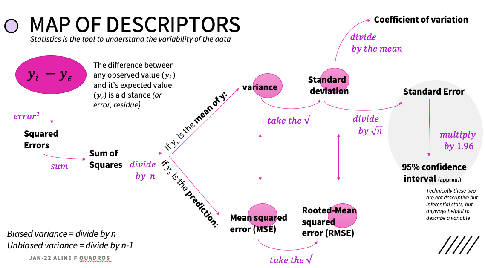

## Statistics for data scientists

Very helpful tools from packages scipy and statsmodels, which are really great and super comprehensive for statistics with Python.

Nice resources to learn more:

Resampling http://www.resample.com/intro-text-online/ This is a very complehensive book about resampling “Resampling: The New Statistics” by Julian L. Simon (1997)
Parametric vs. non-parametric models explained super well here: http://mlss.tuebingen.mpg.de/2015/slides/ghahramani/gp-neural-nets15.pdf
Data distributions very very nice discussion in this thread here: https://www.quora.com/Most-machine-learning-datasets-are-in-Gaussian-distribution-Where-can-we-find-the-dataset-which-follows-Bernoulli-Poisson-gamma-beta-etc-distribution
This awessome free book Gareth James,Daniela Witten, Trevor Hastie, Robert Tibshirani. An Introduction to Statistical Learning with Applications in R https://www.statlearning.com/
